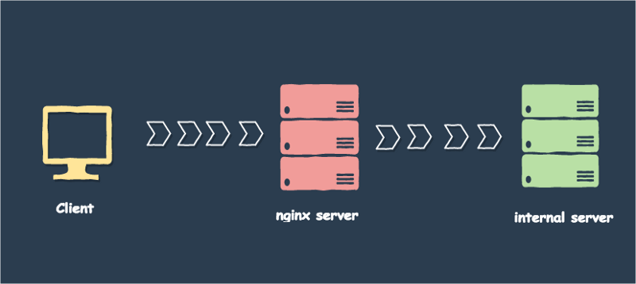

# О Nginx
Nginx — веб-сервер с открытыми исходными кодами наподобие Apache. Несмотря на то что nginx и Apache могут использоваться в качестве веб-серверов, их функциональность и архитектура отличаются. Ниже приведены основные функции nginx.

- HTTP-сервер.
- Балансировка нагрузки.
- Обратный прокси.

# Об обратном прокси

Обратный прокси — промежуточный сервер, который принимает запрос клиента, ретранслирует его на backend-серверы и затем передает ответ сервера обратно клиенту.



С помощью обратного прокси можно обслуживать несколько веб-приложений (с разными доменами) на одном сервере с общедоступным IP-адресом.


Обслуживание веб-приложений с помощью nginx имеет множество преимуществ.

- Уменьшение нагрузки, поскольку nginx может равномерно распределять запросы на backend-серверы.

- Обеспечение безопасности, так как обратный прокси может скрывать существование опрашиваемых им backend-серверов.

- Увеличение производительности, так как nginx может управлять статическим контентом (картинками и CSS).
 
- Простота аудита и логирования с использованием единой точки доступа (порт 80 и 443).


# Сценарий


«У меня есть веб-приложение, написанное на языке Scala и запущенное в Docker. Я использую его с помощью обратного прокси. Я купил домен (www.bankz.com), который будет обслуживать это веб-приложение.

Все запросы сперва поступают в nginx, затем nginx перенаправляет их в приложение Scala. В этом сценарии я использую докеризированный nginx, так как все мои веб-приложения запускаются с помощью Docker.»

Ниже перечислены шаги, которые я предпринял для внедрения и конфигурации приложения:


## 1. Докеризированный nginx:

Так выглядит Dockerfile для nginx-сервера
```
FROM ubuntu:14.04

MAINTAINER Eranga Bandara (erangaeb@gmail.com)

# install nginx
RUN apt-get update -y
RUN apt-get install -y python-software-properties
RUN apt-get install -y software-properties-common
RUN add-apt-repository -y ppa:nginx/stable
RUN apt-get update -y
RUN apt-get install -y nginx

# deamon mode off
RUN echo "\ndaemon off;" >> /etc/nginx/nginx.conf
RUN chown -R www-data:www-data /var/lib/nginx

# volume
VOLUME ["/etc/nginx/sites-enabled", "/etc/nginx/certs", "/var/log/nginx"]

# expose ports
EXPOSE 80 443

# add nginx conf
ADD config/nginx.conf /etc/nginx/conf.d/default.

WORKDIR /etc/nginx

CMD ["nginx"]
```


## 2. Nginx-конфиг

Здесь представлена самая простая конфигурация nginx-файла.

```
server {
    listen          80;
    server_name     bankz.com www.bankz.com;
    location / {
        proxy_pass  http://web:3000/;
    }
}
```

В данной конфигурации nginx слушает `порт 80`, все запросы, приходящие на домен bankz.com, перенаправляются в веб-приложение, которое запущено на `http://web:3000` (web – имя контейнера моего докеризированного приложения. Я использую связанные контейнеры для установления связи между ngnix и веб-приложением).

## 3. Docker-compose

Я запускаю веб-приложение с помощью Docker-compose. Ниже вы увидите простейший Docker-compose-файл.

```
web:
    image: erangaeb/senzweb:0.10
    container_name: web
    ports:
        - 3000:3000nginx:
    image: erangaeb/senznginx:0.4
    container_name: nginx
    ports:
        - 80:80
        - 443:443
    links:
        - web
```

Обратите внимание, что `links` определяется в nginx. Связывая веб-контейнер с nginx, Docker добавляет запись хоста для `web` в `/etc/hosts` nginx- контейнера.


## 4. Как запустить

`docker-compose up -d` будет поднимать и запускать эти два контейнера. Если вы перейдете на `www.bankz.com`, то сайт будет отдавать веб-приложение.

После этого нужно добавить домен `www.bankz.com` в DNS сервер с IP машины, которая запускает nginx контейнер.

Если вы хотите протестировать контейнер в вашем локальном окружении (без DNS), добавьте запись хоста в файл /etc/hosts как показано снизу:

`192.168.59.103 www.bankz.com`

`192.168.59.103` — IP Docker хоста, так как я запускаю Docker с помощью boot2docker на OSX. Если вы запускаете Docker без boot2docker, то можете просто дать IP машине, которая запускает nginx-контейнер.

## `Links`

http://www.yannmoisan.com/docker.html

https://www.keycdn.com/support/nginx-reverse-proxy/

https://www.digitalocean.com/community/tutorials/apache-vs-nginx-practical-considerations
